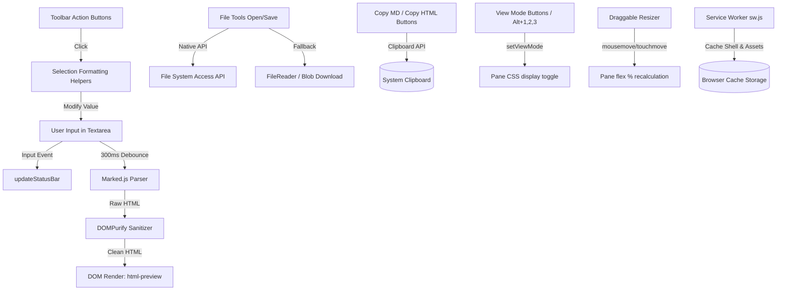

# Technical Architecture Specification

## Metadata & Version History
- **Version**: 1.2.0
- **Date**: 2026-07-29
- **Status**: Updated Baseline (Productivity & UX Features — Undo/Redo, Search & Replace, Auto-Save, Export, H5/H6)

---

## 1. Tech Stack Summary

| Layer | Technology / Library | Version / Source | Confidence Level |
| :--- | :--- | :--- | :--- |
| **Frontend Core** | HTML5, Vanilla CSS3, JavaScript (ES6+) | Native Browser standard | **High** |
| **Markdown Parser** | `marked.js` | via CDN (`jsdelivr/marked`) | **High** |
| **XSS Sanitizer** | `DOMPurify` | v3.0.6 via CDN (`cdnjs`) | **High** |
| **Math Renderer** | `KaTeX` | v0.16.8 via CDN (`jsdelivr`) | **High** |
| **UI Icons** | Font Awesome Free | v6.4.0 via CDN (`cdnjs`) | **High** |
| **Typography** | Inter & JetBrains Mono | Google Fonts CDN | **High** |
| **PWA Manifest** | Web App Manifest | `manifest.json` (Standalone) | **High** |
| **PWA Cache Engine** | Service Worker API | `sw.js` (CacheFirst strategy) | **High** |
| **Storage API** | Web Storage & File System Access API | `localStorage` + Native FS API | **High** |

---

## 2. Architecture Pattern



- **Pattern Description**: Monolithic, dependency-minimal client-side Single-Page Application (SPA).
- **Execution Model**: Event-driven client-side loop. No build toolchain (Babel, Webpack, Vite) or runtime framework (React, Vue, Svelte) required.
- **Confidence**: **High** (Directly verified from repository structure)

---

## 3. Data Layer

- **Volatile Application State**:
  - `fileHandle`: Holds modern `FileSystemFileHandle` reference (null in fallback mode).
  - `currentFileName`: String name of active document (default `Untitled.md`).
  - `isDirty`: Boolean flag tracking unsaved editor state.
  - `searchMatches`: Array of `{ start, end }` character-offset objects for current search results.
  - `searchMatchIdx`: Integer index into `searchMatches` for the active highlighted match.
  - `autosaveTimer`: Timeout handle for the 5-second debounced auto-save scheduler.
- **Persistent Local State**:
  - `localStorage['trialopsiq-theme']` (`'light'` | `'dark'`): Persists user theme selection.
  - `localStorage['trialopsiq-viewmode']` (`'editor'` | `'split'` | `'preview'`): Persists last active view mode across sessions.
  - `localStorage['trialopsiq-draft']`: Full textarea content auto-saved every 5 seconds; cleared on successful file save.
  - `localStorage['trialopsiq-draft-filename']`: Filename associated with the last auto-saved draft.
- **Cache Layer**:
  - Cache Storage key `md-editor-v1`: Stores static HTML, CSS, JS, manifest, and external CDN scripts/fonts for offline execution.
- **Confidence**: **High** (Directly verified from `app.js` and `sw.js`)

---

## 4. Common Utilities & Shared Patterns

### Shared Helper Functions in `app.js`

1. **`updatePreview()`**
   - *Role*: Manages debounced rendering pipeline (300ms delay).
   - *Data Flow*: `markdownInput.value` -> `marked.parse()` -> `DOMPurify.sanitize()` -> `htmlPreview.innerHTML`.

2. **`setTheme(isLight: boolean)`**
   - *Role*: Synchronizes DOM theme state (`light-theme` class), updates theme toggle icon (`fa-sun` / `fa-moon`), button `title`, and persists state in `localStorage`.

3. **`setDirty(dirty: boolean)`**
   - *Role*: Synchronizes UI unsaved state indicator by toggling `.dirty` class on the filename element.

4. **`setFileName(name: string)`**
   - *Role*: Updates active file name state and header display text.

5. **`insertFormatting(prefix: string, suffix: string, defaultText: string)`**
   - *Role*: Standard selection-wrapping text modifier for Markdown formatting (Bold, Italic, Headings, Code, Quote, Links). Restores cursor & focus state and preserves scroll position.

6. **`insertListFormatting(prefixType: 'ul' | 'ol' | 'task')`**
   - *Role*: Line-by-line list prefix insertion helper (handles multi-line selections).

7. **`updateStatusBar()`** *(new in v1.2)*
   - *Role*: Computes and renders real-time word count, character count, line count, and cursor Ln/Col to the status bar DOM elements.
   - *Triggers*: `input`, `click`, `keyup`, `focus` events on `#markdown-input`.

8. **`setViewMode(mode: 'editor' | 'split' | 'preview', persist?: boolean)`** *(new in v1.2)*
   - *Role*: Controls pane and resizer visibility based on the selected view mode. Updates `aria-pressed` on the view toggle buttons. Persists to `localStorage['trialopsiq-viewmode']`.
   - *Triggers*: View toggle button clicks, `Alt+1/2/3` keyboard shortcuts, and on page load (from localStorage).

9. **`initResizer()` (IIFE)** *(new in v1.2)*
   - *Role*: Manages the draggable pane resizer. Handles `mousedown/mousemove/mouseup` and `touchstart/touchmove/touchend` events. Enforces min pane width of 180px. Updates pane `flex` percentages in real-time during drag.

10. **`showToast(message: string, type: 'success' | 'error' | 'info')`**
    - *Role*: Creates and auto-dismisses a toast notification DOM element via CSS transition.

11. **`scheduleDraftSave()`** *(new in v1.3)*
    - *Role*: Debounced (5s) auto-save writer. Writes `markdownInput.value` and `currentFileName` to `localStorage`. Updates the `#status-autosave` chip ("● Saving…" → "✓ Draft saved" → cleared after 3s).
    - *Triggers*: `input` event on `#markdown-input`.

12. **`setAutosaveIndicator(state: 'saving' | 'saved' | '')`** *(new in v1.3)*
    - *Role*: Toggles CSS classes `.saving` / `.saved` on `#status-autosave` and sets its text content.

13. **`openSearchPanel()` / `closeSearchPanel()`** *(new in v1.3)*
    - *Role*: Shows/hides the `#search-panel` floating widget. `openSearchPanel` pre-fills the find field from the current editor selection and immediately runs the first search.

14. **`runSearch()`** *(new in v1.3)*
    - *Role*: Builds the search regex from `#search-input`, `#search-case`, and `#search-regex` and iterates the full textarea value to populate `searchMatches[]`. Updates `#search-count` text.

15. **`highlightMatch(idx: number)`** *(new in v1.3)*
    - *Role*: Sets textarea `selectionRange` to the match at `idx`, scrolls it into view, and updates the count display.

16. **`navigateMatch(direction: 1 | -1)`** *(new in v1.3)*
    - *Role*: Wrapping index increment/decrement into `highlightMatch`.

17. **`buildSearchRegex(term: string): RegExp | null`** *(new in v1.3)*
    - *Role*: Constructs a global RegExp from the search term, respecting case-sensitivity and regex-mode toggles. Returns `null` on invalid regex.

18. **`toggleExportMenu(force?: boolean)`** *(new in v1.3)*
    - *Role*: Toggles visibility of `#export-menu` and updates `aria-expanded` on `#btn-export`.

19. **`downloadBlob(content: string, filename: string, mimeType: string)`** *(new in v1.3)*
    - *Role*: Shared Blob-to-anchor download utility. Creates an object URL, simulates a click, then revokes the URL after 150ms. Used by Export HTML, Export TXT, and the fallback save.

- **Confidence**: **High** (Directly verified from `app.js`)

---

## 5. UI Architecture — Two-Row Toolbar

### HTML Structure
```
<header class="toolbar">
  <div class="app-bar">          <!-- Row 1: Logo + Filename + File Actions + Theme -->
    <div class="app-identity">   <!-- Logo & filename chip -->
    <div class="file-tools">     <!-- New, Open, Save, Copy MD, Copy HTML, Export (dropdown), Search, Theme -->
      <div class="export-wrapper"> <!-- Position:relative wrapper for #export-menu -->
  </div>
  <div class="format-bar">       <!-- Row 2: Scrollable formatting icon button strip -->
    <div class="btn-group">      <!-- History: Undo, Redo -->
    <div class="btn-group">      <!-- Text: Bold, Italic, Strikethrough, Highlight, Sub, Sup -->
    <div class="btn-group">      <!-- Headings: H1 H2 H3 H4 H5 H6 -->
    <div class="btn-group">      <!-- Blocks: UL, OL, Task, Quote, Code, HR, PageBreak -->
    <div class="btn-group">      <!-- Insert: Link, Image, Video, Audio, Table, Math, Callout, Footnote, Note -->
    <div class="btn-group format-bar-end"> <!-- View: Editor | Split | Preview toggles -->
  </div>
</header>
```

### Layout Principles
- **App Bar** is fixed-height, never wraps, always visible.
- **Format Bar** uses `overflow-x: auto` with hidden scrollbar for narrower viewports.
- **View toggles** are right-aligned via `margin-left: auto` on `.format-bar-end`.
- **Active view toggle** uses the accent color background as a pressed-state indicator.

---

## 6. Security & Auth Architecture

- **Authentication / Authorization**:
  - **None**. The application operates 100% client-side with zero remote backend communication. Zero user data collection or telemetry.
  - **Confidence**: **High**

- **Client Security & XSS Mitigation**:
  - **DOMPurify Sanitization**: All HTML generated from user markdown is explicitly sanitized via `DOMPurify.sanitize(rawHtml)` prior to innerHTML injection.
  - **Content Security Policy (CSP)** *(new in v1.2)*: A `<meta http-equiv="Content-Security-Policy">` tag is present in `index.html` restricting `script-src`, `style-src`, `font-src`, and `img-src` to known trusted origins.
  - **Confidence**: **High**

---

## 7. Infrastructure & Deployment

- **Deployment Pattern**: Static Web Hosting (e.g., GitHub Pages, Cloudflare Pages, Vercel Static, or Netlify).
- **Local Server Execution**: Any static HTTP server (e.g. `python -m http.server 8000`, `npx serve`, or direct file system browser launch).
- **Containerization / Docker**: **None present**. (High)
- **CI/CD Pipelines**: **None present** (`.github/workflows` missing). (High)
